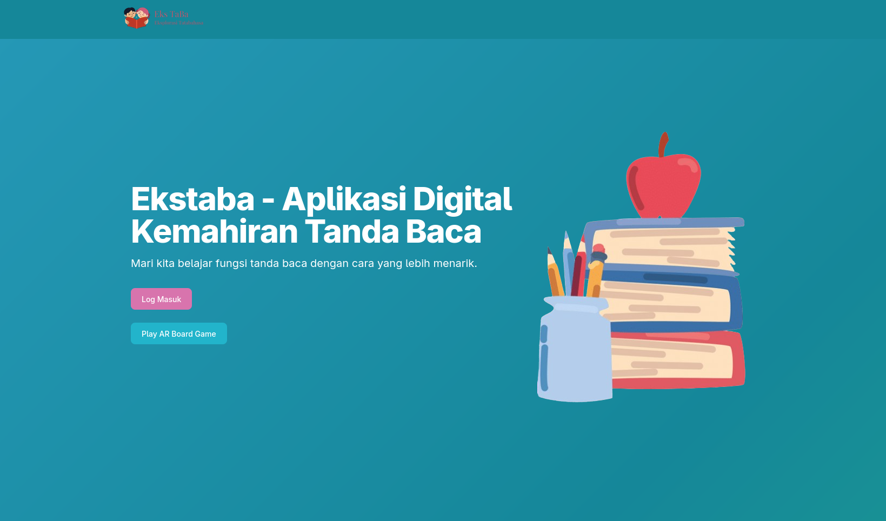
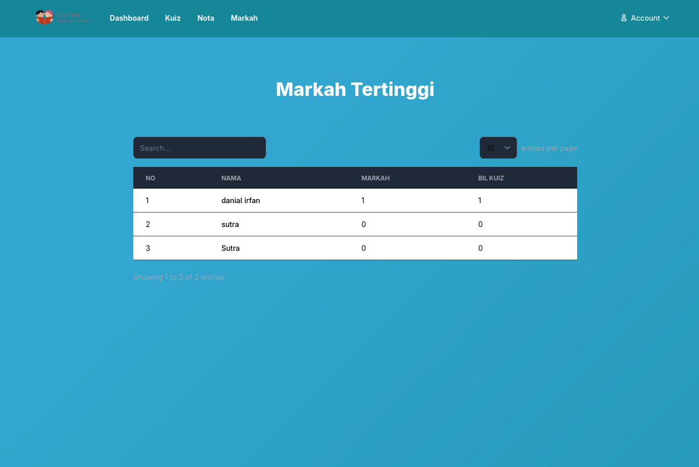
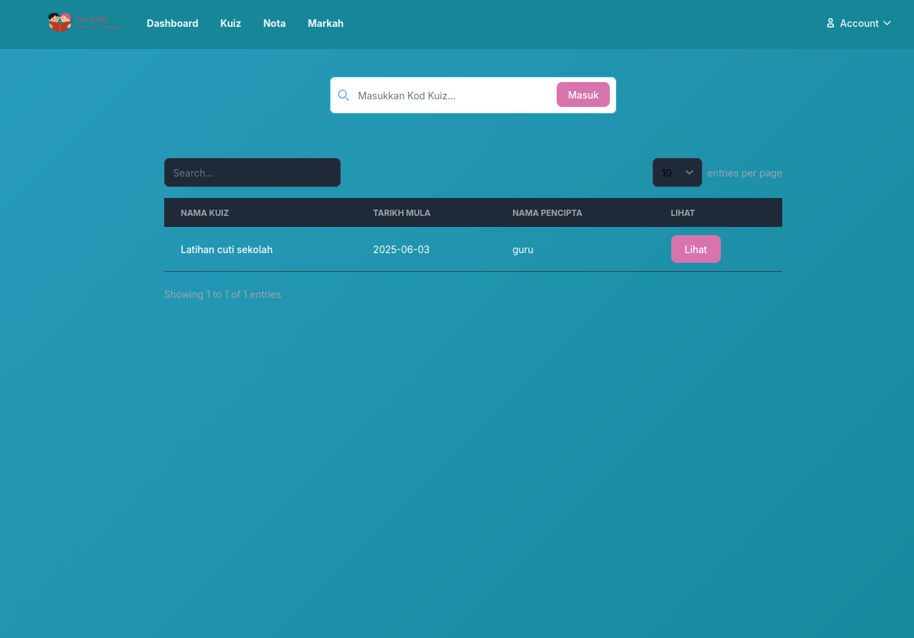
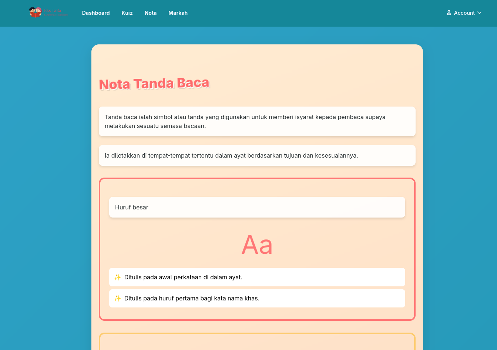
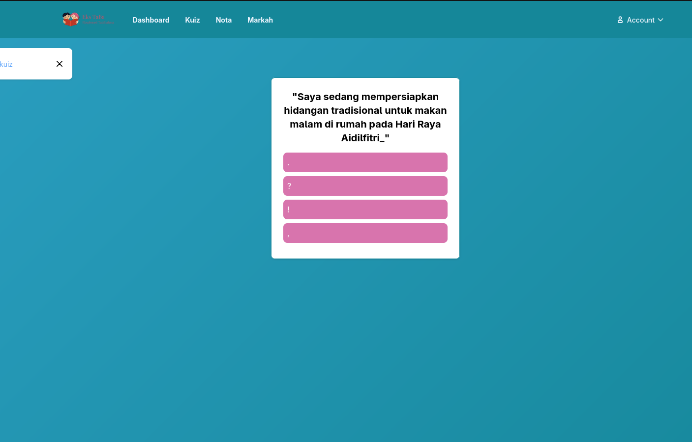
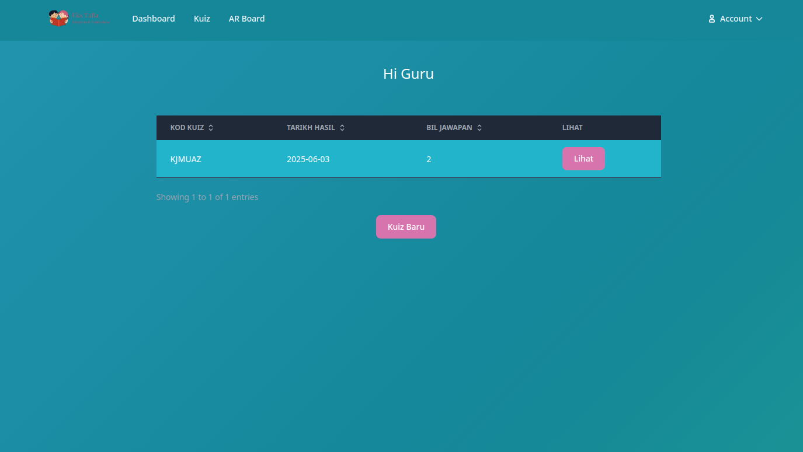
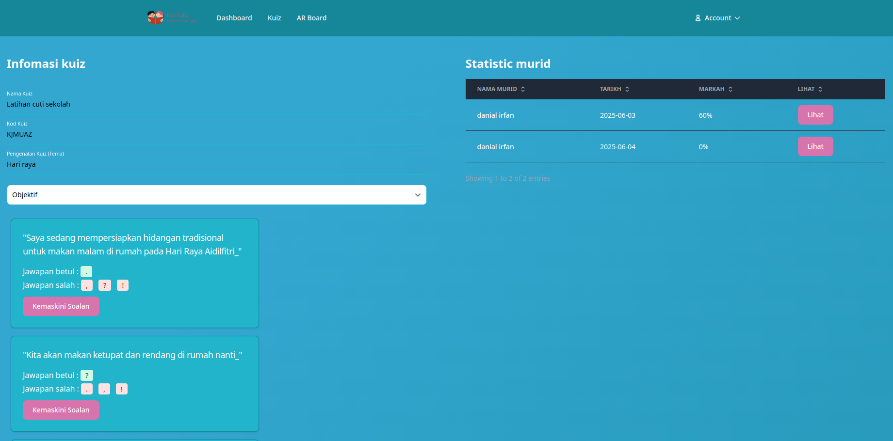
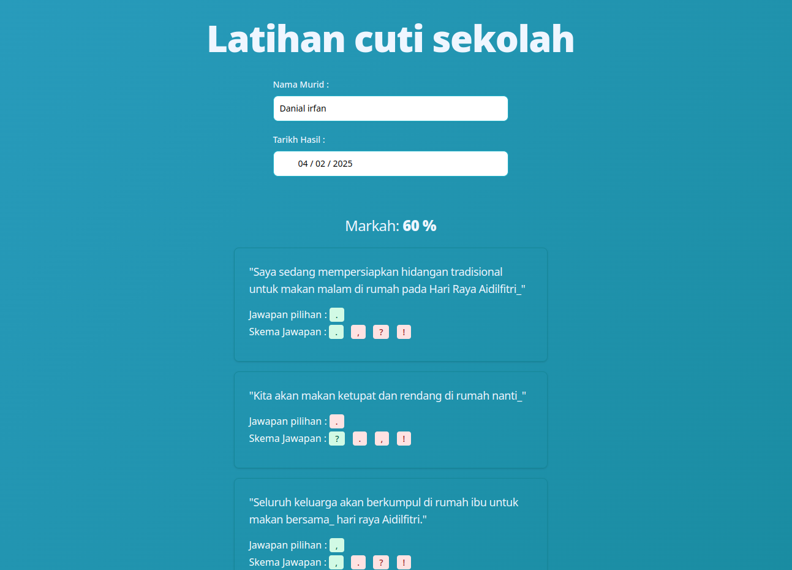
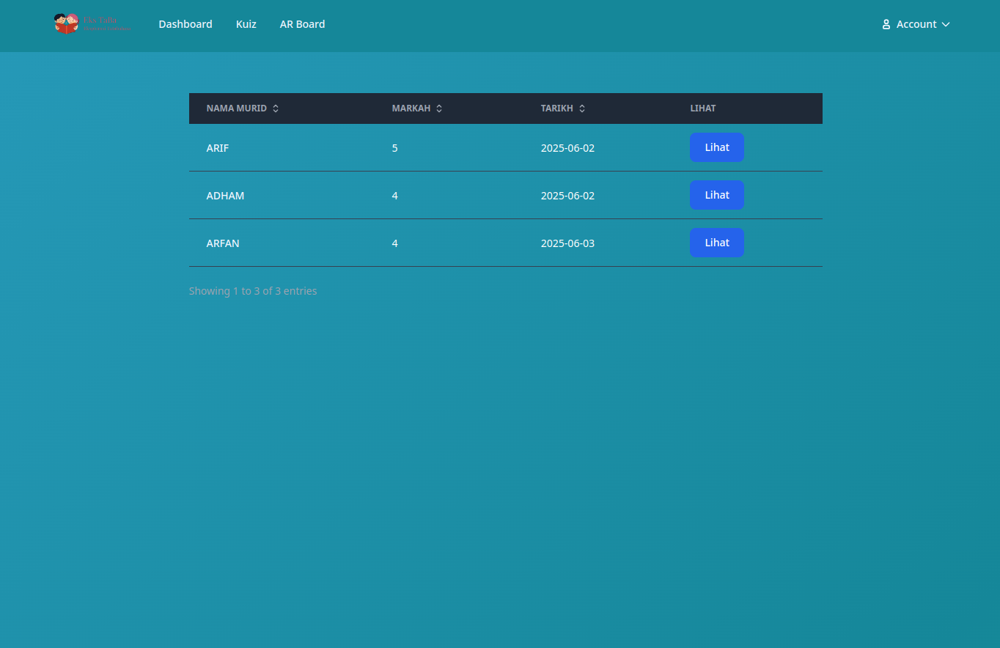

# Ekstaba 

## Pengenalan
Aplikasi Ekstaba atau dikenali sebagai Eksplorasi Tatabahasa diperkenalkan supaya dapat membantu murid dengan cara meningkatkan pengetahuan mereka dalam penggunaan tatabahasa dengan cara yang menarik dan efektif. Aplikasi ini juga membantu guru untuk menilai tahap pengetahuan pelajar agar dapat memastikan pelajar dapat memahami cara penggunaan tatabahasa.

## Penyataan Masalah
- Pelajar sukar untuk memahami kaedah penggunaan tatabahasa dengan cara pembelajaran konvensional.
- Pelajar mudah bosan dengan pembelajaran konvensional.
- Guru sukar untuk menentukan tahap pengetahuan murid.

## Objektif Projek
- Meningkatkan tahap pengetahuan murid dalam penggunaan tatabahasa.
- Menghasilkan kaedah pembelajaran penggunaan tatabahasa yang menarik minat kanak-kanak.
- Membolehkan guru untuk menilai pengetahuan murid dalam pengguna tatabahasa.

## Skop Projek

### Murid

- Murid menjawab soalan tatabahasa yang dihasilkan oleh AI.
- Murid boleh melihat nota khas yang dibekalkan oleh guru.
- Murid boleh bermain board AR dengan cara mengimbas kad dan menyusun kad.
- Murid boleh melihat nilai markah kuiz yang telah dilakukan untuk membuat penambahbaikan.

### Guru

- Guru menganalisis kefahaman murid berdasarkan markah quiz
- Guru menetapkan nota untuk kefahaman murid
- Guru menghasilkan dan mengemaskini kuiz yang dibantu dengan AI.

## Perisian yang digunakan
- PDO PHP
- Tailwindcss
- Flowbite
- Composer: phpmailer/phpmailer
- Composer: google/apiclient
- AR JS

## Gambaran AR Board

## Gambaran Aplikasi 
### Murid

### Guru

